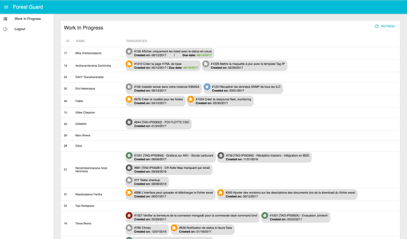

Forest Guard is a [Taiga](https://taiga.io/) dashboard where managers (and any logged user) can see what their teammates are working on (tasks and issues). It is built using the great [admin-on-rest](https://marmelab.com/admin-on-rest/) framework.

The main view is a grid list of users and their assigned tasks and issues that are not closed yet. 



## Start the project

### Using yarn

You need to have yarn installed on your computer. First, install dependencies with 

```
$ yarn install
```

Then you are ready to run the project using

```
$ yarn start
````

If you have a custom Taiga instance, set `REACT_APP_API_URL` and `REACT_APP_API_URL` variables as you start the project:

```
$ REACT_APP_BASE_URL=http://taiga.tag-ip.com REACT_APP_API_URL=http://taiga.tag-ip.com/api/v1 yarn start
```

### Using docker

Build the docker image with

```
$ docker build -t forest-guard .
```

You can set the `REACT_APP_API_URL` and `REACT_APP_API_URL` variables if needed using

```
$ docker build --build-arg REACT_APP_API_URL=http://taiga.tag-ip.com/api/v1 --build-arg REACT_APP_BASE_URL=http://taiga.tag-ip.com -t forest-guard .
```

Then you run the image (here on port 8056) with

```
$ docker run -p 8056:80 --name forest-guard --rm forest-guard
```

Finally, you can push the image in a registry (either docker hub or a private registry) so it can be used from anywhere else : 

```
$ docker tag forest-guard registry.example.org/forest-guard:latest
$ docker push registry.example.org/forest-guard:latest
```

## Environment variables

*Environment variables car be inserted in the `.env` file*

`REACT_APP_API_URL`: The URL for the API root (default to https://api.taiga.io/api/v1)

`REACT_APP_BASE_URL`: The URL of Taiga front-end (default to http://tree.taiga.io/)

`REACT_APP_DUE_DATE_CUSTOM_ATTRIBUTES`: A JSON object that describes custom attributes used as due date field. The structure of the object is like so:

```
{
  PROJECT_X_ID: {
    'issue': CUSTOM_FIELD_X_ID,
    'task': ANOTHER_CUSTOM_FIELD_X_ID
  },
  PROJECT_Y_ID: {
    'issue': CUSTOM_FIELD_X_ID,
    'task': ANOTHER_CUSTOM_FIELD_X_ID
  },
  // ...
}
``` 

`REACT_APP_ISSUE_STATUS_FILTER`: A comma separated list of issue status ID used as filter.

`REACT_APP_TASK_STATUS_FILTER`: A comma separated list of task status ID used as filter.

`REACT_APP_IGNORE_USERS`: A comma separated list of user ID that shouldn't be displayed.
